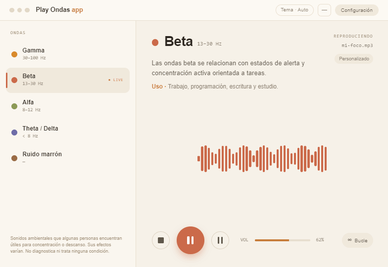
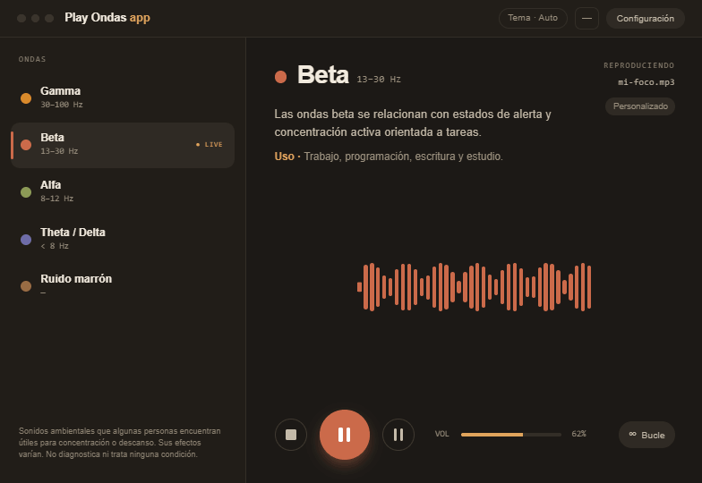
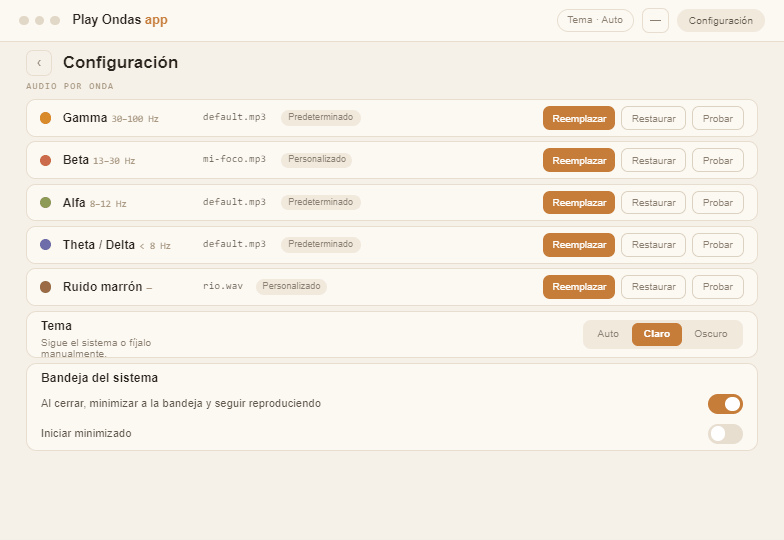
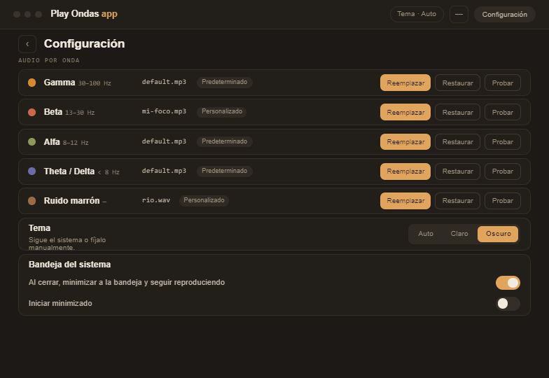
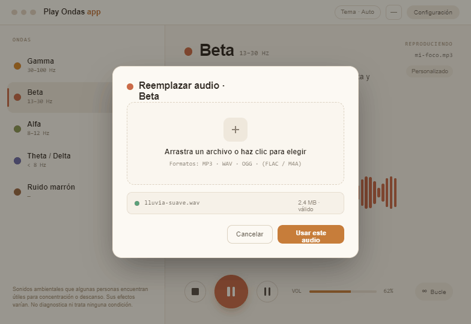
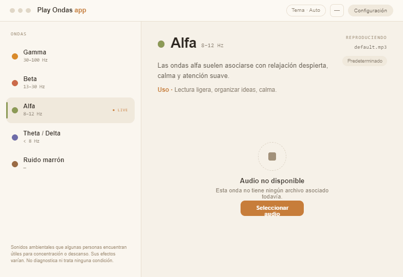
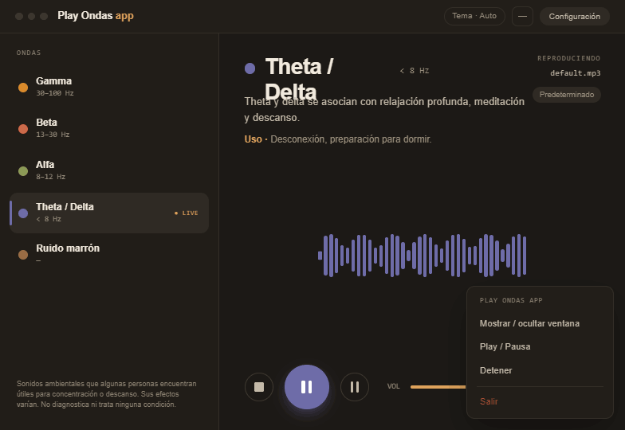
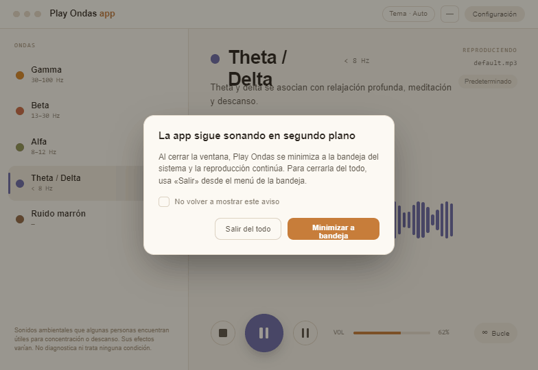

<div align="center">
  

  # Play Ondas app

  **Reproductor de escritorio de ondas cerebrales y sonidos ambientales**

  [](LICENSE)
  [](#descargar)
  [](https://tauri.app)

  [Descargar](#descargar) · [Desarrollo](#desarrollo) · [Licencia](#licencia)
</div>

---

## ¿Qué es Play Ondas app?

Play Ondas app es una aplicación de escritorio para Windows y Linux que reproduce audios de ondas cerebrales y sonidos ambientales diseñados para favorecer la concentración, la relajación y el descanso.

No genera sonidos en tiempo real ni requiere conexión a Internet para funcionar. Los audios predeterminados se descargan automáticamente en el primer arranque y desde entonces la app funciona completamente sin red.

> **Nota**: Esta aplicación reproduce audio pregrabado con fines de acompañamiento sonoro. No pretende diagnosticar, tratar ni curar ninguna condición médica. Los efectos del sonido varían de persona a persona.

---

## Capturas de pantalla

<table>
  <tr>
    <td align="center">
      <br>
      <sub>Pantalla principal · Modo claro</sub>
    </td>
    <td align="center">
      <br>
      <sub>Pantalla principal · Modo oscuro</sub>
    </td>
  </tr>
  <tr>
    <td align="center">
      <br>
      <sub>Configuración · Modo claro</sub>
    </td>
    <td align="center">
      <br>
      <sub>Configuración · Modo oscuro</sub>
    </td>
  </tr>
</table>

<details>
<summary>Ver más capturas</summary>

<table>
  <tr>
    <td align="center">
      <br>
      <sub>Reemplazar audio</sub>
    </td>
    <td align="center">
      <br>
      <sub>Audio no disponible</sub>
    </td>
  </tr>
  <tr>
    <td align="center">
      <br>
      <sub>Bandeja del sistema</sub>
    </td>
    <td align="center">
      <br>
      <sub>Minimizar a bandeja</sub>
    </td>
  </tr>
</table>

</details>

---

## Funcionalidades

### Cinco tipos de sonido

| Onda | Frecuencia orientativa | Descripción |
|------|------------------------|-------------|
| **Gamma** | ~40 Hz | Activación cognitiva y atención sostenida |
| **Beta** | 12–30 Hz | Concentración, pensamiento analítico |
| **Alfa** | 8–12 Hz | Relajación alerta, creatividad tranquila |
| **Theta / Delta** | 0.5–7 Hz | Descanso profundo, meditación |
| **Ruido marrón** | — | Enmascaramiento de ruido ambiente |

### Reproducción

- Controles de **Play / Pausa / Stop** con bucle siempre activo
- **Cambio de onda instantáneo**: al seleccionar otra onda el audio cambia sin pulsar Play
- **Atajos de teclado**: `Ctrl+Shift+P` (play), `Ctrl+Shift+X` (pausa), `Ctrl+Shift+S` (stop)
- Control de **volumen** con persistencia entre sesiones

### Personalización de audio

- **Reemplaza** el audio de cualquier onda con tu propio archivo MP3, WAV u OGG
- La app copia el archivo a su directorio de datos — el original puede borrarse o moverse sin problema
- **Restaura** el audio predeterminado en cualquier momento

### Experiencia

- **Tema claro / oscuro / automático** (sigue el sistema)
- **Bandeja del sistema**: minimiza la app y controla la reproducción sin abrir la ventana
- **Persistencia completa**: volumen, onda seleccionada, audios personalizados y preferencias se guardan entre sesiones
- Descarga automática de audios en el primer arranque con progreso visible
- Funciona completamente **sin conexión** después del primer arranque
- Recuperación automática ante configuración corrupta

---

## Descargar

Descarga el instalador de la última versión desde la página de [**Releases**](../../releases/latest):

| Plataforma | Archivo |
|------------|---------|
| Windows 10/11 (x64) | `PlayOndasApp_x.x.x_x64_en-US.msi` |
| Linux x64 (AppImage) | `play-ondas-app_x.x.x_amd64.AppImage` |

### Windows

Ejecuta el instalador `.msi`. WebView2 se incluye en el instalador si el sistema no lo tiene.

### Linux

Haz el AppImage ejecutable y ábrelo:

```bash
chmod +x play-ondas-app_*.AppImage
./play-ondas-app_*.AppImage
```

---

## Desarrollo

### Requisitos previos

- [Node.js](https://nodejs.org/) 22+ LTS
- [pnpm](https://pnpm.io/) 11+
- [Rust](https://rustup.rs/) stable (edition 2024)
- **Linux**: `sudo apt install libwebkit2gtk-4.1-dev libappindicator3-dev librsvg2-dev patchelf`
- **Windows**: [WebView2](https://developer.microsoft.com/en-us/microsoft-edge/webview2/) (normalmente ya instalado en Windows 10/11)

### Clonar e instalar

```bash
git clone https://github.com/danimardo/play-ondas-app.git
cd play-ondas-app
pnpm install
```

### Arrancar en modo desarrollo

```bash
pnpm tauri dev
```

### Ejecutar los tests

```bash
# Tests de TypeScript
pnpm test

# Tests de Rust
cargo test --manifest-path src-tauri/Cargo.toml
```

### Compilar para distribución

```bash
pnpm tauri build
```

Los artefactos se generan en `src-tauri/target/release/bundle/`.

---

## Stack tecnológico

- [Tauri 2](https://tauri.app/) — framework de escritorio (Rust + WebView)
- [Svelte 5](https://svelte.dev/) — frontend con runes
- [TypeScript](https://www.typescriptlang.org/) — tipado estricto
- [Tailwind CSS 4](https://tailwindcss.com/) — estilos
- [Zod](https://zod.dev/) — validación de esquemas
- [Pino](https://getpino.io/) / [loglevel](https://github.com/pimterry/loglevel) / `tracing` — logging estructurado

---

## Licencia

Este proyecto se distribuye bajo la licencia **GPL-3.0-or-later**. Consulta el fichero [LICENSE](LICENSE) para más detalles.

Los audios predeterminados incluidos en la aplicación están sujetos a sus propias licencias, detalladas en [`AUDIO-CREDITS.md`](AUDIO-CREDITS.md).

Las fuentes tipográficas (Hanken Grotesk, Space Mono) se distribuyen bajo la licencia **SIL Open Font License 1.1**.

Los iconos de la interfaz son de [Lucide](https://lucide.dev/), licencia **ISC**.

---

<div align="center">
  <sub>Hecho con ♥ por <a href="https://github.com/danimardo">Daniel Diez Mardomingo</a></sub>
</div>
